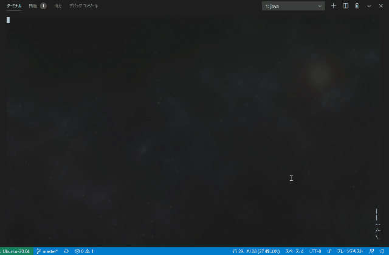

# YASL4J(Yet Another SL for Java)

Ported the ultimate key type correction software [SL](https://github.com/mtoyoda/sl/blob/master/README.ja.md) to Java.
The functions and algorithms are almost the same as the original program, but sounds are now produced.

## Build

```bash
gradle fatJar
```

## Run

```bash
java -jar build/libs/yasl4j-all-in-one-X.X.X-SNAPSHOT.jar # Linux or Mac OS
javaw  -jar build/libs/yasl4j-all-in-one-X.X.X-SNAPSHOT.jar # Windows
```

Check the available options with the -h option.

If you are in a WSL2 environment on Windows, you can run it without javaw. [Here](https://poniti.hatenablog.com/entry/2020/01/08/002536) is a reference for making sounds with WSL2.

## Using GraalVM native-image

GraalVM's native-image allows you to use **sl** command with the same usability as the original.

```bash
native-image -jar build/libs/yasl4j-all-in-one-X.X.X-SNAPSHOT.jar
mv yasl4j-all-in-one-1.0-SNAPSHOT sl
./sl # execute yasl4j
```

Copyright (c) 2021 Yoshiyuki Karezaki(y.karezaki@gmail.com)<br>
Original Copyright 1993,1998,2014 Toyoda Masashi (mtoyoda@acm.org) https://github.com/mtoyoda/sl/

